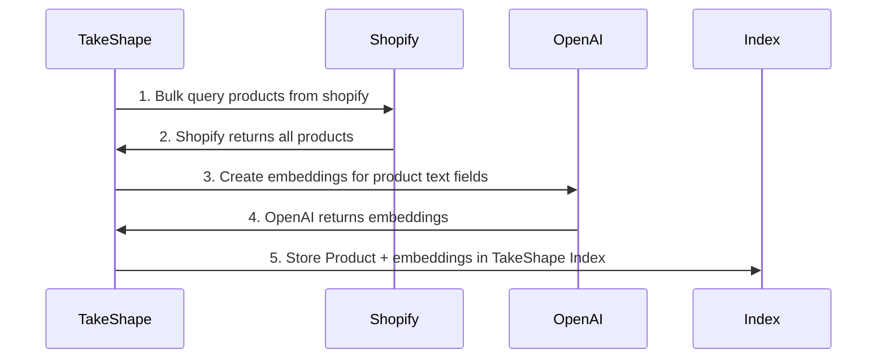
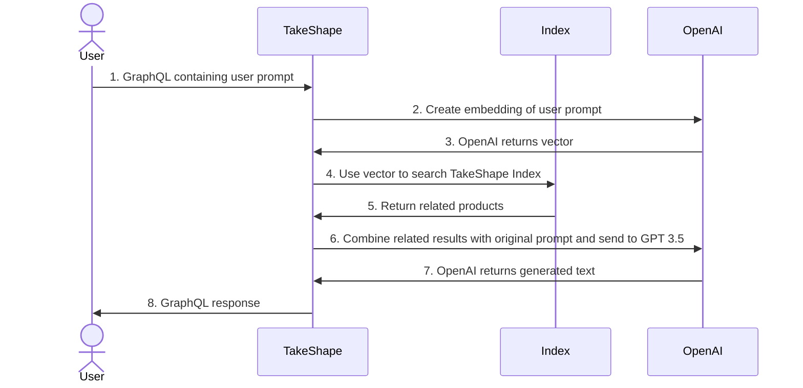

# Retrieval Augmented Generation (RAG) Example
<a href="https://app.takeshape.io/add-pattern?repo=https://github.com/takeshape/rag-example/tree/main"></a>


## Instructions

### Create a new TakeShape Project
1. Click [Deploy to TakeShape](https://app.takeshape.io/add-pattern?repo=https://github.com/takeshape/rag-example/tree/main).
1. Select "Create new project" from the dropdown
1. Enter a name for the new project or leave the default
1. Click "Add to TakeShape"

### Add your API keys


#### OpenAI


1. Create an OpenAI API Key https://platform.openai.com/api-keys with the "Models" and "Model capabilities" permissions (this example uses `/v1/embeddings` and `/v1/chat/completions`)
2. Copy/paste your API key into the service configuration dialog
3. Click "Save"

#### Shopify Admin


Follow the directions in the [TakeShape Shopify documentation](https://app.takeshape.io/docs/services/providers/shopify) to connect Shopify Admin API

### Try it out!
Once your services are connected now try out the API in the API Explorer

```graphql
{
  completion(text: "what shoes should I buy?")
}
```

```graphql
{
  getRelatedProductList(text: "what shoes should I buy?" size: 3) {
    items {
      _id
      title
      descriptionHtml
    }
  }
}
```

## How it works

This example demonstrates how to use TakeShape's vector capabilities combined with indexing to enable the RAG use-case. A prerequisite for RAG is to populate a vector database, for this example we will use TakeShape's built-in index. The first step to preparing our data is to extend `Shopify_Product` with a vector property that contains an embedding created by OpenAI. Once we have a our extended `Shopify_Product` we can use API Indexing to iterate over every product and store the combined data in our Index:


This combined `Shopify_Product` will be kept up to date by listening to Shopify webhooks and will be fully re-indexed every 24hrs. 

Now that our `Shopify_Product` data is stored in the built-in index we can perform RAG:

## Schema
This section explains the schema features and steps used to enable RAG. The starting point of this guide is a project created with the [web client](https://app.takeshape.io) with both "Shopify Admin" and "OpenAI" services added and `Shopify_Product` added.

### Add vector property
The first step is to add a vector property to our `Shopify_Product` shape:
```json
{
  "vector": {
    "type": "array",
    "items": {
      "type": "number"
    },
    "title": "Vector",
    "@tag": "vector"
  }
}
```
Vectors are arrays of floating point numbers which is easy to express using the JSON Schema syntax. Using the `@tag` annotation with the value of `vector` tells TakeShape to treat this array property as a vector and to enable vector (knn) search on it. In this property we want to store the OpenAI calculated embedding of the text content of the `Shopify_Product`. To specify this we use an `@resolver` annotation to tell TakeShape how to get the embedding from OpenAI:
```json
{
  "vector": {
    "type": "array",
    "items": {"type": "number"},
    "title": "Vector",
    "@tag": "vector",
    "@dependencies": "{title description}",
    "@resolver": {
      "name": "ai:createEmbedding",
      "service": "openai",
      "model": "text-embedding-3-small",
      "options": {"useDependencies": true}
    }
  }
}
```
We use the `ai:createEmbedding` resolver to send the text content of `Shopify_Product`, as defined by `@dependencies`, to OpenAI to create a vector.


### Enable API Indexing
After adding the vector property to `Shopify_Product` the next step is to enable indexing:
```json
{
  "Shopify_Product": {
    ...
    "cache": {
      "enabled": true,
      "triggers": [
        {
          "type": "schedule",
          "loader": "list",
          "interval": 1440
        },
        {
          "type": "webhook",
          "loader": "get",
          "service": "shopify",
          "events": [
            "products/create",
            "products/update",
            "products/delete"
          ]
        }
      ],
      "fragment": {
        "maxDepth": 2
      }
    },
    "loaders": {
      "list": {
        "query": "shopify:Query.products"
      },
      "get": {
        "query": "shopify:Query.product"
      }
    },
    "schema": {...}
  }
}
```
Above is the default indexing configuration for `Shopify_Product` generated by checking the "Indexing" checkbox in the Shape Editor UI. This configuration will index all products every 24hrs using the the list loader and will index single products in response to a webhook.

### Create `getRelatedProductList` query
Once indexing is enabled the next step is to create the `getRelatedProductList` query. This query composes OpenAI's `createEmbedding` mutation and TakeShape's `vectorSearch` resolver:
```json
{
  "queries": {
    "getRelatedProductList": {
      "shape": "PaginatedList<shopify:Product>",
      "resolver": {
        "compose": [
          {
            "name": "ai:createEmbedding",
            "id": "createEmbedding",
            "service": "openai",
            ...
          },
          {
            "shapeName": "Shopify_Product",
            "name": "takeshape:vectorSearch",
            "service": "takeshape",
            ...
          }
        ]
      },
      "args": {
        "type": "object",
        "properties": {
          "text": {
            "type": "string"
          },
          "size": {
            "type": "integer"
          }
        },
        "required": [
          "text"
        ]
      }
    }
  }
}
```
This query uses a `compose` resolver to execute  `ai:createEmbedding` and then pass the resulting vector to `takeshape:vectorSearch` which searches our indexed `Shopify_Product`. First let's look at the resolver to fetch the embedding:
```json
{
  "name": "ai:createEmbedding",
  "id": "createEmbedding",
  "service": "openai",
  "model": "text-embedding-3-small",
  "args": {
    "ops": [{"path": "input", "mapping": "$args.text"}]
  }
}
```
This resolver looks very similar to the resolver in the previous section, but it is creating an embedding of th query you pass in the `text` arg. Then we take the resulting vector and pass it into the `vector.value` arg of the `takeshape:vectorSearch` resolver:
```json
{
  "shapeName": "Shopify_Product",
  "name": "takeshape:vectorSearch",
  "service": "takeshape",
  "args": {
    "ops": [
      {"path": "vector.name", "value": "vector"},
      {
        "path": "vector.value",
        "mapping": "$resolvers.createEmbedding"
      },
      {"path": "size", "mapping": "$args.size"}
    ]
}
```
Note that the `vector.name` is set to `"vector"` to correspond with the property name on `Shopify_Product`. The `size` argument determines the number of related (k in k-nearest neighbors).

### Create `chat` mutation
The last step is to put it all together with the `chat` mutation. To generate text in response to a users prompt we are composing `getRelatedProductList` with OpenAI's `createChatCompletion`:

```json
{
  "queries": {
    "chat": {
      "shape": "string",
      "resolver": {
        "compose": [
          {
            "name": "delegate",
            "id": "getRelatedProductList",
            "to": "Query.getRelatedProductList",
            ...
          },
          {
            "name": "ai:generateText",
            ...
          }
        ]
      },
      "args": {
        "type": "object",
        "properties": {
          "text": {
            "type": "string"
          }
        },
        "required": [
          "text"
        ]
      }
    }
  }
}
```
First we take the `text` arg and fetch top related product using `getRelatedProductList`:
```json
{
  "name": "delegate",
  "id": "getRelatedProductList",
  "to": "Query.getRelatedProductList",
  "options": {
    "selectionSet": "{ items {title description} }"
  },
  "args": {
    "ops": [
      {
        "path": "text",
        "mapping": "$args.text"
      },
      {
        "path": "size",
        "value": 1
      }
    ]
  },
  "results": {
    "ops": [
      {
        "path": "$",
        "mapping": "$currentResolver.items[0]"
      }
    ]
  }
}
```
Then we combine the text from the top related product and the user's original prompt and send it to GPT 3.5 using's `ai:generateText` resolver:
```json
{
  "name": "ai:generateText",
  "service": "openai",
  "model": "gpt-3.5-turbo",
  "systemPrompt": "You are a helpful assistant.",
  "inputTemplate": "Answer the following question:\n{$args.input} \n\nby using the following text:\n{$resolvers.getRelatedProductList.title} {$resolvers.getRelatedProductList.description}"
}
```

